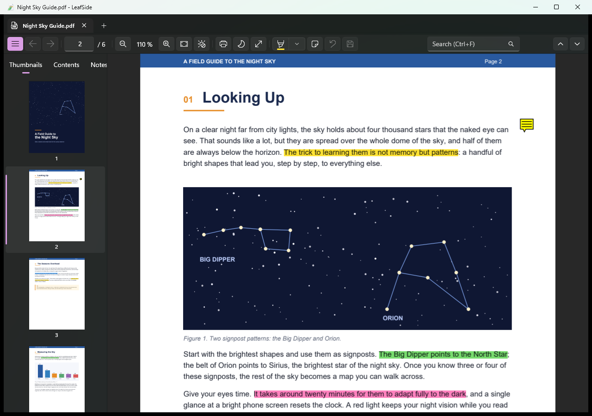
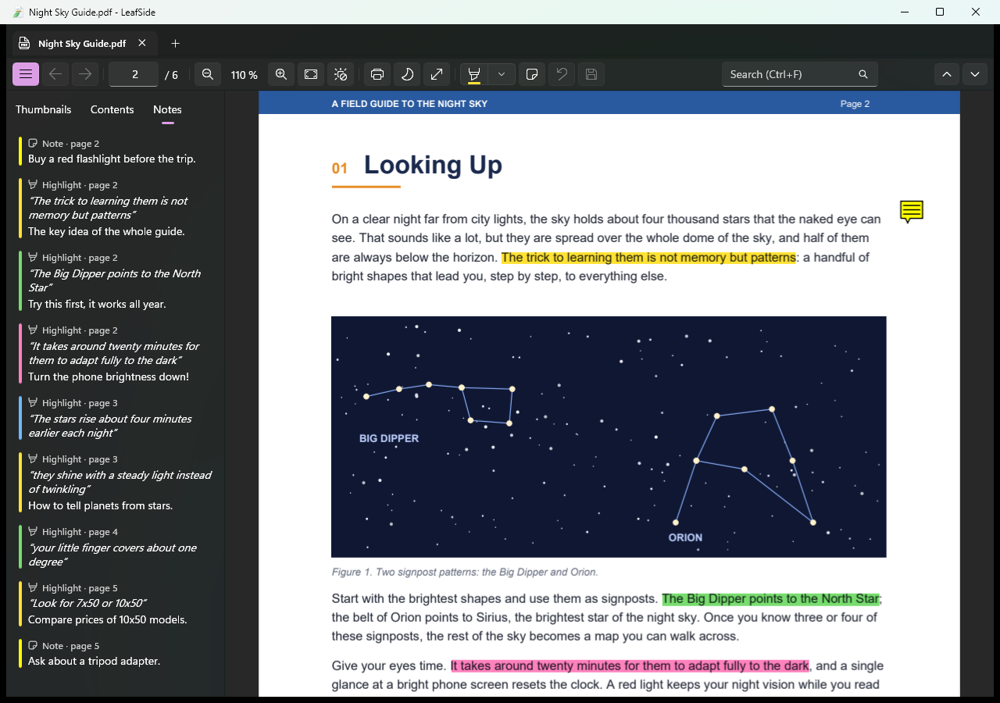
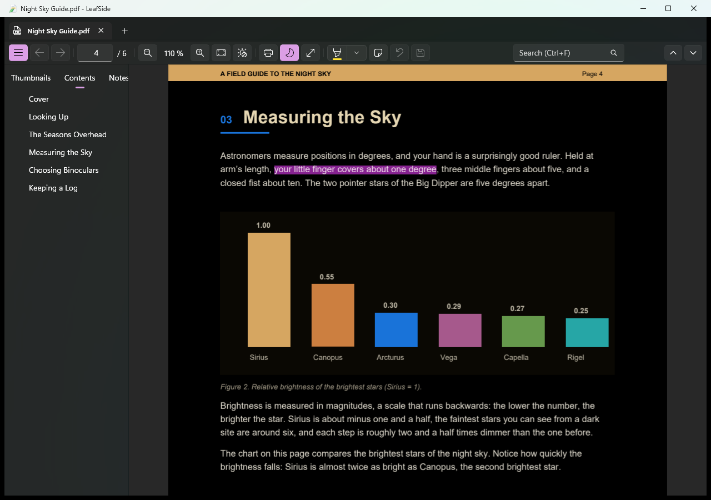

<div align="center">


# LeafSide

**A fast, native PDF reader for Windows that scrolls like butter, on ARM64 and x64.**

Highlight, take notes, search and print — without lag, without ads, without an account.

[](https://github.com/Jmzp/winui-pdf-reader/actions/workflows/ci.yml)
[](https://github.com/Jmzp/winui-pdf-reader/releases/latest)
[](https://github.com/Jmzp/winui-pdf-reader/releases)
[](LICENSE)


**[⬇️ Download the latest version](https://github.com/Jmzp/winui-pdf-reader/releases/latest)**

</div>



Built with WinUI 3 and PDFium, it runs as native code on **Windows on Arm** (Surface and other Snapdragon
laptops and tablets) as well as on Intel and AMD PCs. Scrolling never waits for a page to render, and pages
stay sharp at any zoom.

## ✨ Features

<table>
<tr>
<td width="50%" valign="top">

### 🚀 Smooth by design
- Continuous scrolling with inertia, at 60 fps or more
- Pinch, touchpad and Ctrl+wheel zoom from 10 % to 1000 %
- Sharp text at any zoom, rendered in the background
- Native ARM64 build: no x64 emulation

</td>
<td width="50%" valign="top">

### 🖍️ Highlights and notes
- Highlighter in four colors, sticky notes and comments
- Saved **inside the PDF** as standard annotations: Edge, Acrobat and phone apps show them too
- A *Notes* panel lists them all; click one to jump to it
- Undo / redo, and a prompt before closing with unsaved changes

</td>
</tr>
<tr>
<td valign="top">

### 📑 Find your way
- Tabs, page thumbnails and the table of contents
- Search with every match highlighted
- Internal and web links, with Back / Forward
- Select text with mouse or pen and copy it

</td>
<td valign="top">

### 🔖 Picks up where you left off
- Remembers the page, the exact position and the zoom of every file
- Reopens the tabs of your last session
- Recent files on the start page

</td>
</tr>
<tr>
<td valign="top">

### 🌙 Comfortable reading
- Night mode with inverted colors
- Full screen (F11)
- Double-tap zoom on touch screens
- English and Spanish UI, following Windows

</td>
<td valign="top">

### 🖨️ Fits into Windows
- Printing through the Windows dialog, as sharp vector output
- *Open with* for PDFs; files open as tabs in the same window
- Drag and drop, password-protected PDFs
- Installer or portable zip, no admin rights needed

</td>
</tr>
</table>

<table>
<tr>
<td width="50%"></td>
<td width="50%"></td>
</tr>
<tr>
<td align="center"><em>Every highlight and note in one panel</em></td>
<td align="center"><em>Night mode and the table of contents</em></td>
</tr>
</table>

🔒 **Private by design:** no account, no telemetry, no ads. Your files never leave your PC.

## ⬇️ Download

Get the latest version from **[Releases](https://github.com/Jmzp/winui-pdf-reader/releases/latest)**:

| Device | Installer (recommended) | Portable zip |
| --- | --- | --- |
| Intel / AMD PCs | `LeafSide-<version>-win-x64.msi` | `LeafSide-<version>-win-x64.zip` |
| Windows on Arm (Surface with Snapdragon, other ARM64 PCs) | `LeafSide-<version>-win-arm64.msi` | `LeafSide-<version>-win-arm64.zip` |

- **Installer:** double-click the `.msi`. It installs for your user only (no administrator rights) into
  `%LocalAppData%\Programs\LeafSide`, adds a Start menu entry and *Open with* for PDFs, updates older
  versions in place, and is removed from *Settings → Apps*.
- **Zip:** extract the **whole** zip and run `LeafSide.exe`.

Neither needs the .NET runtime. The app isn't code-signed yet, so SmartScreen may ask you to confirm: click
*More info → Run anyway*.

Requires Windows 10 version 2004 (build 19041) or later; Windows 11 recommended.

## ⌨️ Keyboard shortcuts

| Keys | Action |
| --- | --- |
| Ctrl+O / Ctrl+W | Open file / close tab |
| Ctrl+F, F3 / Shift+F3 | Search, next / previous match |
| Ctrl+G | Go to page |
| Ctrl+ / Ctrl- / Ctrl+0 | Zoom in / out / fit width |
| Alt+← / Alt+→ (or mouse back/forward buttons) | Back / forward |
| Ctrl+P | Print |
| Ctrl+S / Ctrl+Shift+S | Save highlights and notes / save as |
| Ctrl+Z / Ctrl+Y | Undo / redo (highlights and notes) |
| F11, Esc | Full screen, exit full screen |
| Space / PgUp / PgDn / Home / End | Scroll by screen, go to first / last page |

## How it stays smooth

Many PDF readers stutter on ARM devices for two reasons: they run emulated (x64 code translated to
ARM64), and they render pages on the same thread that handles scrolling. This reader avoids both:

1. **The compositor scrolls, not the UI thread.** WinUI's `ScrollView` (InteractionTracker) moves the
   content at display refresh rate even while the app is busy.
2. **Only pages near the viewport exist.** Page elements are virtualized and recycled.
3. **Rendering happens in the background, most urgent first.** A dedicated render thread uses a priority
   queue. Visible pages come before prefetch, and pages that scroll out of view are cancelled before
   they're rendered.
4. **Progressive quality.** Each page first shows a cheap thumbnail, then a sharp bitmap for the
   current zoom. Above ~8 megapixels it switches to 1024 px **tiles**, and only the visible ones are
   rendered. During a pinch the existing bitmaps are scaled, and they are re-rendered once the zoom
   settles.
5. **GPU upload off the UI thread.** Bitmaps become `CompositionDrawingSurface`s (Win2D) on the render
   thread, so the UI thread only attaches finished surfaces.
6. **Native PDFium for x64 and ARM64** via P/Invoke.

Measured with the built-in benchmark (a 300-page document with dense vector art, continuous scrolling,
x64 release build):

| Zoom | Frame p50 | Frame p99 | Frames over 33 ms |
| --- | --- | --- | --- |
| 125 % (whole-page bitmaps) | 5.5 ms | 9.6 ms | 0 |
| 300 % (tiles) | 5.6 ms | 8.6 ms | 0 |

Run it yourself: drag a PDF onto `Benchmark.bat` in the release folder, or run
`LeafSide.exe --bench file.pdf`. The result is written to `%LocalAppData%\PdfReader\bench.log`.

## Building from source

Requirements: Windows 10/11 and the [.NET 10 SDK](https://dotnet.microsoft.com/download). Visual Studio
is optional; everything builds with the `dotnet` CLI. The Windows App SDK, Win2D and PDFium come from
NuGet or are included in the repository.

```powershell
dotnet test tests/PdfReader.Core.Tests                      # unit tests
dotnet build src/PdfReader.App -c Release -p:Platform=x64   # or -p:Platform=ARM64
.\build\publish.ps1                                         # zips and MSI installers for both, in artifacts\
```

To run a debug build:
`src\PdfReader.App\bin\x64\Debug\net10.0-windows10.0.22621.0\win-x64\LeafSide.exe [file.pdf]`.

`tests/assets/make_sample.py` (Python 3) generates the heavy 300-page `sample.pdf` used for manual and
benchmark testing.

### Project layout

```
src/PdfReader.Core     UI-independent engine: PDFium P/Invoke, page layout, render scheduler, LRU cache,
                       tile planner, search, annotations (undo, saving), reading state, navigation history,
                       print layout
src/PdfReader.App      WinUI 3 app: PdfViewer (virtualized pages), PageView, DocumentView, MainWindow,
                       services (state, printing, file association, localization)
src/native/pdfium      pdfium.dll for win-x64 and win-arm64 (with licenses)
tests/                 xUnit tests for Core, engine and localization resources
installer/             Per-user MSI (WiX Toolset 5, restored from NuGet)
packaging/             Files shipped next to the exe (README.txt, LEEME.txt, Benchmark.bat)
build/publish.ps1      Release packaging
```

### Localization

UI strings live in `src/PdfReader.App/Strings/<language>/Resources.resw`. `en-US` is the default and
`es` is Spanish. XAML uses `x:Uid`, and code uses `Loc.Get` / `Loc.Format`. To add a language, copy the
`en-US` folder and translate it. `LocalizationTests` checks that every language has the same keys and
placeholders. Set `PDFREADER_LANGUAGE=en-US` (or `es`) to force a language when testing.

## Data and privacy

The only network request is the update check: once a day, LeafSide asks GitHub's public API for the latest
release (`api.github.com/repos/Jmzp/winui-pdf-reader/releases/latest`). It sends nothing about you or your files,
only the app's name and version as the User-Agent. Downloads start only when you click the button, and the file's
SHA-256 is checked against the one GitHub publishes. Turn the check off with *Check for updates automatically*
on the start page.

The app only writes to a PDF when you save your highlights and notes, and then the save is incremental and atomic:
the original bytes are kept, and a failed save never leaves a damaged file. It stores:

- its state (reading positions, recent files, open tabs, settings) in `%LocalAppData%\PdfReader\state.json`;
- the *Open with* registration under `HKCU\Software\Classes` (`LeafSide.exe --unregister` removes it).

## Limitations

- Annotations are limited to highlights and notes (other kinds are shown but not edited). No form filling or
  page editing. Encrypted PDFs can be read but not annotated.
- The print dialog shows no preview.
- Releases are not code-signed yet.

## License

LeafSide is free software, licensed under the [GNU General Public License v3.0](LICENSE) or later: you can
use, study, share and modify it, and versions you distribute must stay open under the same license. Version
1.0.0 was released under the MIT license. Third-party components and their licenses are listed in
[THIRD-PARTY-NOTICES.md](THIRD-PARTY-NOTICES.md).
